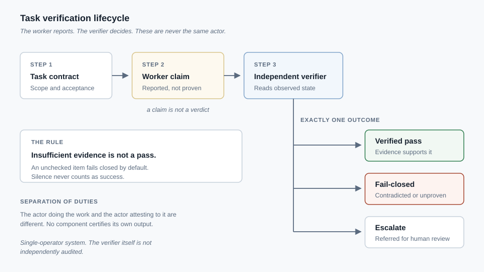

# Thomas Jarvis

**Junior cybersecurity and security operations. I build systems that check their own work, and I document what they cannot prove.**

CompTIA A+, Network+, Security+ · A.A.S. System Security and Analysis
Hope Mills, North Carolina — open to remote

---

## Target roles

Security Operations / SOC Analyst (Tier 1) · Junior Cybersecurity Analyst · Platform or Infrastructure Security · Security Automation

---

## Scope of this portfolio

This portfolio spans cybersecurity, systems engineering, local-first AI, distributed systems,
software products, and research methodology. Each project states what is **publicly demonstrated**,
what is **implemented** but private, and what remains **unverified**. Where supporting material is
private, the page says so rather than implying proof that is not offered.

---

## Strongest security proof

### [Multi-Agent Verification Factory](projects/verification-factory.md)
A task pipeline built on one rule: an automated worker's report of success is a **claim**, not a
fact. A separate deterministic verifier inspects observed system state and issues the only outcome
that counts, and insufficient evidence fails closed rather than passing quietly.

Separation of duties and independent audit — controls from security practice — applied to automated
work. *Status: Implemented; single-operator, not independently verified.*

---

## Selected Engineering Work

| Project | What it is |
|---|---|
| **[Verification Factory](projects/verification-factory.md)** | A verifier-governed task pipeline where no component certifies its own output and missing evidence fails closed. |
| **[Security Operations Practice](projects/security-operations.md)** | Graded security-operations coursework — access-control review, an intrusion timeline, a posture assessment — alongside a self-built SOC tooling prototype. |
| **[Home Lab and Compute Infrastructure](projects/infrastructure-networking.md)** | A personal network reached through a private device-authorized overlay instead of a forwarded port, plus compute routed by measured CPU/GPU crossover. |
| **[Local-Inference Desktop Platform](projects/local-inference-platform.md)** | A Windows desktop application whose core model inference runs locally on CPU, with no hosted model API in that path. |
| **[Product Platforms](projects/product-platforms.md)** | Several independently built product surfaces — four services **deployed and operated** on a container platform, with the API, integration, and cost trade-offs behind them. |
| **[Distributed Systems](projects/distributed-systems.md)** | A network paying for independently re-checked useful computation, on a **multi-service AWS footprint I deployed and operated**. |
| **[Quantitative Research System](projects/quantitative-research.md)** | A walk-forward research instrument built to find the flaws in its own results, including formal retraction of findings that failed review. |
| **[Machine-Learning Model Publication](projects/machine-learning-models.md)** | Open model bases, local-first design constraints, and a deliberate line between what is published and what is withheld. |
| **[Technical Decision Records](projects/technical-decision-records.md)** | Thirteen decisions with the alternatives rejected and what the evidence showed — including where nothing was measured. |

Status labels used throughout: **Deployed and operated** · **Publicly demonstrated** ·
**Implemented** · **Prototype** · **Research instrument** · **Coursework** ·
**Available on request**.

Full index with descriptions: [projects/](projects/README.md)

---

## Skills

**Security operations** — access control and RBAC review · incident-response process · log correlation · endpoint telemetry · detection concepts · NIST SP 800-53 · CIS Controls · ISO/IEC 27001

**Networking** — OSPF · EIGRP · VLANs · ACLs · NAT/PAT · TCP/IP · VPN and overlay networks · firewall policy

**Automation and development** — Python · Bash · FastAPI · REST APIs · SQL · Git · Linux · JSON schema design · test automation

**Infrastructure** — Linux administration · cloud deployment and operations (serverless compute, managed NoSQL/relational data, CDN, DNS, object storage, queueing/pub-sub, containerised service deployment) · storage architecture · performance measurement · CPU/GPU workload routing

*Studying: BGP, multi-area OSPFv3, first-hop redundancy, cloud platform fundamentals.*

---

## Certifications

| Certification | Issuer | Verify |
|---|---|---|
| CompTIA Security+ (ce) | CompTIA | [Verify on Credly](https://www.credly.com/badges/1d0d7bea-94cc-49a7-9072-dc84543fafc3/public_url) |
| CompTIA Network+ (ce) | CompTIA | [Verify on Credly](https://www.credly.com/badges/1f67330f-d702-453f-8f78-110b86615fe6/public_url) |
| CompTIA A+ (ce) | CompTIA | [Verify on Credly](https://www.credly.com/badges/6c466800-d6fe-4ae8-9a4d-02b0389ad2b8/public_url) |

## Education

| Credential | Status |
|---|---|
| A.A.S., System Security and Analysis | Awarded 2023 |
| Associate of Arts, University Transfer | Awarded 2015 |
| A.A.S., Information Technology – Network Administration | In progress |
| A.A.S., Information Technology – Cloud Management | In progress |
| University cybersecurity coursework | Coursework completed — no degree conferred |

---

## Evidence and scope

The diagrams in this repository are sanitized and safe to share. Supporting material behind the
project pages — coursework artifacts, task and verification records, lab files, and benchmark
measurements — is **deliberately not published here**, because it contains coursework material,
system details, and personal identifiers that do not belong in a public repository. It is available
to a reviewer on request. See the [evidence index](evidence/README.md).

Where a claim would need private material to believe, this portfolio either states it plainly as
unverified or leaves it out.

### Scope of the work

- **Deployed and operated:** a multi-service AWS footprint and four services on a container
  platform — see [Distributed Systems](projects/distributed-systems.md) and
  [Product Platforms](projects/product-platforms.md).
- **Implemented:** the verification pipeline and the personal network and compute environment,
  both built and run by me as single-operator systems.
- **Prototype:** the SOC tooling. Partially implemented, never production-operational.
- **Coursework:** the security-operations artifacts, the networking labs, and Azure/Google Cloud
  platform study.

### What I have not done

I have not worked on a security team, handled a live incident, or deployed or administered a
commercial SIEM or EDR product. On Azure and Google Cloud specifically, I have not deployed any
infrastructure — that experience is coursework and tooling familiarity only (my deployed cloud
experience is on AWS and a container platform; see Scope of the work above). No code here has
been audited by a third party.

I would rather you know that from the page than discover it in an interview.

---

## Contact

- **Email:** thomasjarvis2026@gmail.com
- **LinkedIn:** https://www.linkedin.com/in/thomas-jarvis-0453716b
- **GitHub:** https://github.com/jarvist0254/ftcc-professional-portfolio

*Available for junior security roles — remote, or in the Fayetteville and Raleigh area.*
