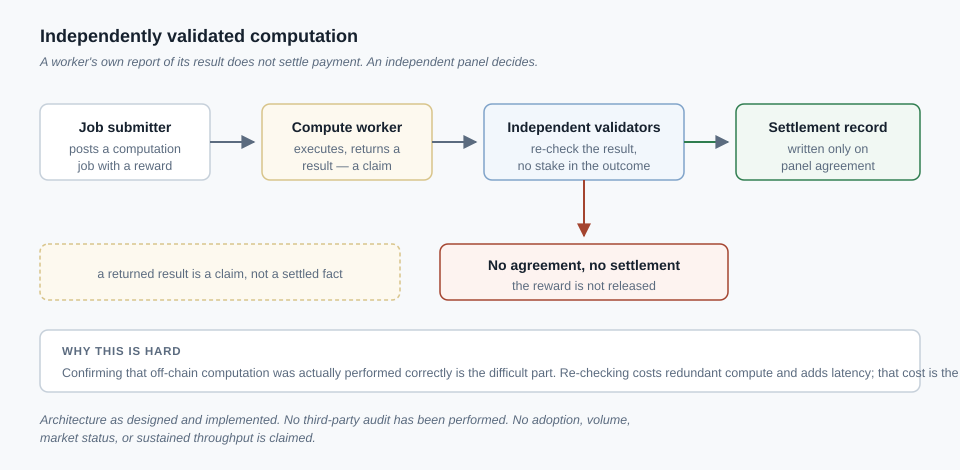

# Distributed Systems
*A blockchain network designed to pay for verifiable useful computation rather than for hash-based mining.*

**Status:** Implemented — the architecture is designed and built end to end. Independently verified public operation is a separate thing and is not claimed on this page.

## Problem

Standard proof-of-work mining spends real electricity solving arbitrary hash puzzles with no value outside securing the chain. I wanted to know whether that spend could instead go toward computation someone actually needs — training or running an AI workload — while keeping the property that makes proof-of-work useful: strangers can agree on what happened without trusting any single participant.

That reframing runs into a hard problem: if a worker gets paid for computation done off-chain, how does the network know it was performed correctly, without trusting the worker's word or re-running the whole job itself, which defeats the point of paying someone else to do it? Verifying off-chain compute cheaply, without a single point of trust, is the genuinely hard part of this design — harder than the token mechanics around it.

## What I built

A task marketplace and reward system implemented as smart contracts in Rust using the Anchor framework on a high-throughput chain: a job marketplace (creation, bidding, escrow, settlement), a reward distribution program, a validator registry, an escrow/vault mechanism holding funds until a job is confirmed, and governance primitives for parameter changes. Off-chain, a serverless backend pattern coordinates job intake and status: managed functions handle request-scoped logic, a NoSQL table layer holds job, worker, and consensus records, and an API orchestration layer exposes endpoints to clients and the desktop client below.

**The core design idea — Proof of Useful AI Work.** A client submits a computation job. A worker executes it and submits a result with a proof artifact. Rather than accept that result on the worker's say-so, an independent panel of validators re-checks it, and only when enough agree does the result settle on-chain and the reward release. A worker's own report that it "did the work correctly" is a claim, not evidence.

**Why that verification step is hard, not incidental.** Re-running every job on every validator would prove correctness, but it throws away the economic point of outsourcing computation — you'd pay N times over to avoid trusting one worker. The alternative, a smaller validator panel independently reproducing results and requiring threshold agreement before anything settles, buys back most of the cost savings at the price of a probabilistic rather than absolute guarantee. Getting the incentives right so a colluding minority can't cheaply force a false result through is the real engineering problem here — designed and implemented, not formally verified.

A desktop compute client lets a worker contribute GPU capacity and receive rewards through non-custodial wallet integration: the platform never holds a worker's funds; rewards go directly to a wallet the worker controls.

## Technical decisions

**A custom useful-work consensus mechanism instead of plain stake-weighted validation.** Proof-of-stake secures a chain but ties nothing to any external output. Tying rewards to re-checked computation keeps the "pays for something real" property proof-of-work has and stake-only consensus does not.

**Independent multi-validator re-checking instead of trusting a worker's self-reported result.** A worker's own success report is exactly the kind of unverified claim that should never trigger payment — the same governance problem, solved the same way, as the pattern on my Verification Factory page (see Related work).

**Threshold agreement instead of full re-execution by every validator.** Full re-execution is provably correct but removes the cost advantage of outsourcing compute at all — the option I rejected. A smaller panel reaching threshold agreement trades absolute certainty for a workable cost structure, worth stating plainly rather than glossing over.

**Serverless orchestration instead of a persistently running coordination server.** Job submission traffic is spiky, not steady. An always-on server fleet sized for peak load sits mostly idle; managed functions and a NoSQL layer scale with actual request volume instead.

**Non-custodial wallet integration instead of a custodial reward-holding account.** Holding worker funds in a platform-controlled account is a much larger liability, and regulatory question, than paying rewards directly to a wallet the worker already controls.

## Publicly demonstrated / evidence available

**Publicly verifiable now:** the diagram above, showing the job → worker → validator-panel → settlement flow in generic form, is in this repository for direct inspection. No repository link, block-explorer link, or live endpoint is asserted as current, verified evidence here.

**Available only on request, not independently verifiable here:** the smart contract source, the validator-consensus implementation, the architecture documentation, and the desktop client.

## Outcome

The project demonstrates a working design and implementation of a consensus mechanism that inserts an independent check between a worker completing off-chain computation and being paid for it — the same governance instinct, applied to blockchain settlement instead of task orchestration, that shows up elsewhere in this portfolio. Building it required reasoning honestly about where a probabilistic verification scheme is good enough, and where it is not.

## Honest scope boundary

No third-party smart-contract audit has been performed. No regulatory approval, registration, or compliance status is claimed. I am not claiming verified adoption, transaction volume, profitability, token value, current exchange or listing status, or sustained real-world throughput. The architecture is documented and implemented; independently verified public operation is a separate claim I am not making. No wallet addresses, mint addresses, token identifiers, contract addresses, API endpoints, or deployment dates are published here.

## Related work

- **[Multi-Agent Verification Factory](verification-factory.md)** — the strongest connection on this page. Both systems refuse to accept a worker's self-report as proof of completed work, and both put an independent check between doing the work and being paid or credited for it — one settles that check as a task verdict, the other on-chain.
- **[Product Platforms](product-platforms.md)** — the same serverless pattern (functions, a data layer, orchestration) used here for job coordination reappears there, applied to service-business products.
- **[Secure Home Lab and Compute Infrastructure](infrastructure-networking.md)** — a smaller-scale instance of routing compute work by measured behavior rather than assumption, the same instinct behind not trusting a claim without an independent check.
- **[Technical Decision Records](technical-decision-records.md)** — the independent-validator choice on this page, and twelve other decisions, with the alternatives rejected.
