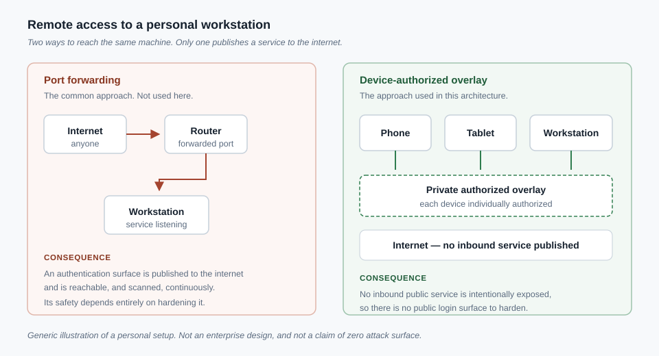
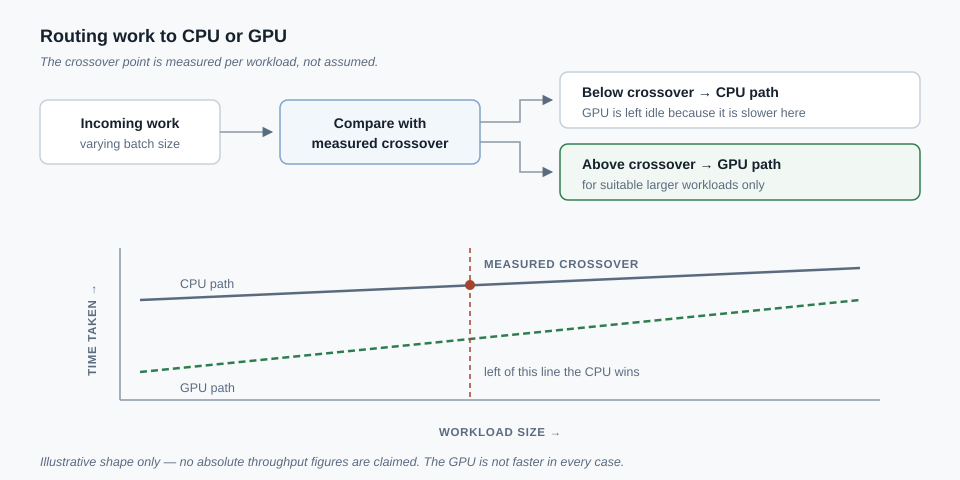

# Secure Home Lab and Compute Infrastructure

*A private-overlay network and a measured CPU/GPU compute environment, built to run everything else in this portfolio.*
**Status:** Implemented — built and in personal use; router/switch labs and Azure/Google Cloud platform work are coursework, not production deployment. (Cloud deployment and operations experience does exist elsewhere in this portfolio, on AWS and a container platform — see [Distributed Systems](distributed-systems.md) and [Product Platforms](product-platforms.md).)

## Problem

I needed to reach a home workstation from a phone and a tablet while away from my desk. The common way to do this is to forward SSH or a file-share port through the home router, putting an authentication endpoint on the public internet where it gets scanned continuously by bots looking for exactly that exposure. I wanted remote access without adding a target.

Separately, the machine-learning and simulation work elsewhere in this portfolio needed sustained CPU and GPU throughput and durable data writes across long-running jobs, without either process starving the other or output silently corrupting on a crash. Answering those questions by measurement, not assumption, became its own piece of engineering.

## What I built

A private mesh overlay network joins the workstation and my mobile devices, each authorized individually rather than through a shared credential; no service on the workstation intentionally listens on a public port. A compute layer runs a pool of CPU workers alongside GPU-accelerated scoring under Linux on Windows, with work routed to CPU or GPU by measured per-workload throughput crossover points rather than a fixed preference. A four-tier storage layout assigns drives to roles by measured write-durability latency. Separately, I completed 22 router and switch simulation labs covering OSPF, EIGRP, access control lists, and NAT (**Coursework**), and I am partway through cloud-platform coursework and tooling setup for Azure and Google Cloud (**Coursework**, in progress) — Azure and GCP remain tooling familiarity only, with no resources deployed on either. That is distinct from AWS and the container platform, where I have deployed and operate real services (see [Distributed Systems](distributed-systems.md) and [Product Platforms](product-platforms.md)).

## Technical decisions

**Overlay VPN instead of port-forwarding.** Forwarding a service through the router is the standard home-lab pattern, but it creates a public authentication surface. Joining every device to a private, device-authorized overlay network means there is no intentionally exposed inbound public service in this personal architecture — not a hardened listener, an absent one. Small-scale zero-trust: don't defend a perimeter you don't need to expose.

**Measured crossover routing instead of GPU-always.** It is tempting to assume an accelerator always wins. I measured throughput for each workload class at a range of batch sizes instead. Below the measured threshold, the GPU is slower than a warm CPU by a wide margin, and the router correctly leaves it idle rather than using it by default.

**Interval flushing instead of per-write synchronous flushes.** Per-record synchronous disk flushes guarantee durability but cap throughput. I moved to flushing at task boundaries and on a fixed interval, keeping byte-identical output. In a controlled, same-machine comparison this measured a 2.92x throughput improvement, from a single sample of one workload's tail segment — I have not measured the improvement across a full cold-start run.

**Storage tiers by measured latency, not nameplate spec.** I assigned drives to roles (active work vs. archive) by measured write-commit latency rather than trusting rated specifications, and set a rule that live computation never targets an archive-tier drive.

**Retracting an unverified figure.** An earlier note claimed roughly a 5% overall speedup from the GPU work. This was an arithmetic error: an optimized compute phase was divided into a wall-clock total dominated by unrelated steps it did not touch. I traced the error and withdrew the claim — the same deliberate mark-invalid-before-replacing discipline used for research findings elsewhere in this portfolio (see [Quantitative Research](quantitative-research.md)), not a one-off correction.

## Publicly demonstrated / evidence available

**Publicly verifiable now:** the two diagrams above, showing the overlay-network pattern in generic, non-identifying form and the measured CPU/GPU routing crossover, are in this repository for direct inspection.

**Available only on request, not independently verifiable here:** the underlying crossover-threshold measurements, including cases where the GPU loses; the fsync/durability comparison with its sample-size caveat; storage-tier latency measurements; the router/switch lab files; and the record of the withdrawn speedup claim. Internal records, not publicly reproducible figures, available on request to a legitimate reviewer.

## Outcome

The result is a workstation reachable from mobile devices with no intentionally exposed inbound public service in this personal architecture, and a compute/storage design whose performance claims are backed by measurement, including the uncomfortable ones. Withdrawing an incorrect figure once identified stands as evidence of that discipline.

## Honest scope boundary

This is a single-user home network, not an enterprise deployment, and it has no production change-control process. No infrastructure has been deployed on Azure or Google Cloud specifically; that remains coursework and tooling familiarity only — it does not describe cloud deployment generally, which I have done on AWS and a container platform (see [Distributed Systems](distributed-systems.md) and [Product Platforms](product-platforms.md)). The routing and switching work is simulation-lab coursework, not configuration of production hardware. The benchmark figures cited above come from single-workload samples on one machine, not from broad or repeated benchmarking, and are stated with that limitation each time.

## Related work

- [Quantitative research](quantitative-research.md) — the workloads this compute and storage layer was built to run.
- [Local-inference platform](local-inference-platform.md) — another project whose local-CPU inference decisions rest on the same measured-crossover discipline used here.
- [Technical decision records](technical-decision-records.md) — the fuller record of judgment calls behind this and other projects, including ones that did not make this page.
