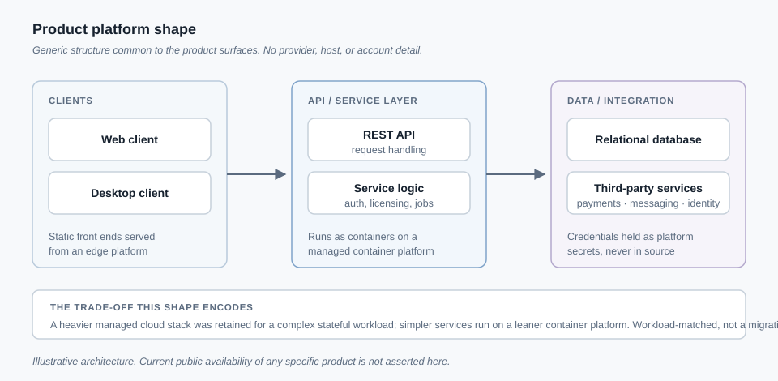

# Product Platforms
*Multiple independently built web and desktop product surfaces, and the architecture and cost trade-offs behind them.*

**Status:** Mixed — one product line retired, the rest implemented and previously operated at beta/alpha status. Current public availability is not asserted on this page.

## Problem

Most of this work started from one question: given a small, self-funded infrastructure budget, what is the leanest architecture that still supports real payment processing, real customer communication, and a real login flow, without over-building for scale that does not exist yet? I built several independent product surfaces to answer that under different constraints, and one of them taught me when to retire a line rather than keep patching it.

## What I built

A small portfolio of separately deployed surfaces:

- **A parent company site** — a static informational page, no server-rendered logic.
- **A desktop trading-research application** (Windows) — a subscription-gated client billed through a payment processor, with its own licensing backend.
- **A lead-capture and intake service** — SMS and voice webhooks, email, and a web login flow, to catch and qualify inbound leads a small business would otherwise miss.
- **A contractor operations dashboard** — a multi-page web app (leads, scheduling, quoting, invoicing) as the operator-facing counterpart to the intake service.
- **A mobile companion app** (Android) — a cross-platform build authenticating against the dashboard's API with short-lived tokens.
- **A desktop game-coaching client** — a local-first app running its own small classifier on-device, always requiring user confirmation before surfacing advice.
- **A retired e-commerce platform** — an earlier full-stack storefront shut down in favor of the products above.

Across the newer products: Python/FastAPI services, mostly fronted by a managed relational database, with payment processing, SMS/voice telephony webhooks, an OAuth login flow, and REST APIs consumed by both the web dashboard and the mobile app.

I am not asserting any of these is currently live as of this writing. Status moves between paused, beta, and retired over time, and I have not independently re-verified it here — ask me directly rather than trusting anything implied on this page.

## Technical decisions

**Static delivery on an edge platform instead of a server-rendered app for pages with no per-request logic.** Marketing pages don't change per visitor; running an origin server to render identical content adds cost with no benefit, so those went to an edge/CDN platform with zero-config deploys.

**A lightweight container platform for the newer, simpler backends, instead of the heavier managed stack used for the oldest one.** The retired e-commerce platform ran on a fuller managed cloud stack — load-balanced compute, a managed database with failover, a managed cache, a web application firewall — because it carried real stateful, multi-service complexity. The newer, simpler services don't need that, so they run leaner. Both were kept: workload fit, not a verdict that the heavier stack was wrong.

**A shared backend module reused across products, instead of writing each backend from zero.** Auth handling, third-party API routing with fallback, and caching were extracted once and reused. The trade-off is coupling, accepted to avoid re-solving the same plumbing repeatedly.

**A minimum viable channel first, instead of building every communication channel at once.** The intake service shipped text and email first; voice was a deliberate second phase, added once the cheaper channel proved the workflow.

**Retiring the e-commerce line instead of continuing to invest in it.** It had a working checkout and a real catalog, but the unit economics did not justify continued investment against the products above. A decision on what not to build is still an engineering decision.

## Publicly demonstrated / evidence available

**Publicly verifiable now:** the diagram above, showing the shape of the product architecture and cost model in generic form, is in this repository for direct inspection.

**Available only on request, not independently verifiable here:** the itemized monthly infrastructure cost breakdown (the fixed recurring cost lands in the low tens of dollars per month, by design), the break-even comparison against subscription pricing, and the backend codebases and deployment configuration for each product. I am not publishing a precise dollar figure as a verified fact, and I am not publishing revenue, subscriber, or customer counts anywhere in this portfolio.

## Outcome

The result is a working pattern for standing up a service-business product cheaply: static delivery where nothing is dynamic, a lean container platform where a service is simple, and the heavier managed stack reserved for the one workload that needed it. The cost model targets a single paying subscriber covering the fixed monthly infrastructure cost several times over — a design target, not a claim it has been achieved at scale. Retiring the weakest line freed attention for the products that fit the model better.

## Honest scope boundary

I am not claiming any product here is currently live, in active production use, or has paying customers, active subscriptions, or a verified adoption number. No third-party security audit or compliance certification has been performed on any of these systems. At least one dashboard product's deployment status has, at points, been internally ambiguous between "built and running locally" and "deployed publicly" — I am not resolving that here by asserting a status I have not re-verified. The infrastructure cost figures are directional, not audited financials. Current availability of any product named above should be confirmed directly with me, not assumed from this page.

## Related work

- **[Secure Home Lab and Compute Infrastructure](infrastructure-networking.md)** — the same cost-aware, measured-not-assumed approach, applied to a personal compute environment.
- **[Local-Inference Desktop Platform](local-inference-platform.md)** — the desktop trading-research application above is documented in full architectural detail there.
- **[Distributed Systems](distributed-systems.md)** — the same serverless-backend instinct (functions, a data layer, orchestration) reused for a blockchain compute network instead of a service business.
- **[Technical Decision Records](technical-decision-records.md)** — the platform trade-off described here, stated as a decision record with the alternative that was rejected.
