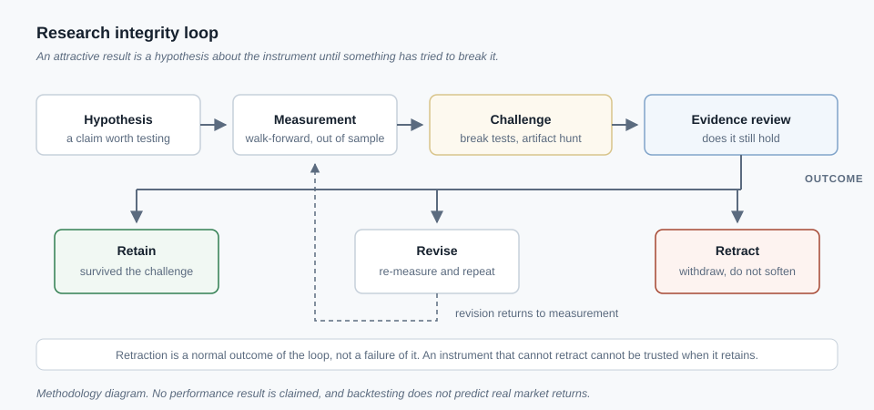

# Quantitative Research System

*A walk-forward research instrument built to find the flaws in its own results.*

**Status:** Research instrument — a methodology and measurement system, not a product-performance claim. See the boundary section below for what this explicitly is not.

## Problem

Any backtest can be made to look good by fitting it to the same data it is tested on. The harder problem is building a research process whose main job is finding the ways a promising-looking result is wrong before that result becomes a decision. I wanted a measurement instrument for paper-trading strategy research that treats its own headline findings as claims to be attacked, not results to be defended — and I wanted specific occasions where it worked: times the system caught and withdrew its own mistake.

## What I built

A walk-forward research harness that tests a candidate strategy across a series of rolling out-of-sample windows rather than a single in-sample fit, and requires it to survive a break-test gate before any configuration change is allowed to ship. Every simulated order routes to a paper-trading account only; there is no path from a research signal to a live brokerage order, and multiple independent risk gates sit between a proposal and an executed order regardless of that. Before a new input is wired into a model, it goes through a no-lookahead audit, and the system separately checks for inputs that are silently backed by a fixed placeholder value on days when real data is unavailable — a placeholder that looks like a real reading unless someone checks for it.

A durable checkpoint layer records progress at task boundaries so a long run can be interrupted — a crash, a restart, an operator pause — and resumed from where it left off; one recovered run produced output that was byte-for-byte identical to what an uninterrupted run would have produced. Underneath the research harness, compute is split across CPU worker processes and GPU-accelerated scoring, routed by measured throughput rather than by assumption — covered on the [infrastructure and compute page](infrastructure-networking.md) rather than repeated here. Formal retraction is a designed step in this process, not an outcome to avoid: when an audit finds that a result does not hold up, the finding is written down, the original claim is marked invalid, and the corrected understanding replaces it in the record rather than quietly overwriting it.

## Technical decisions

**Walk-forward evaluation across rolling windows, instead of a single in-sample backtest.** A single fit over one historical window will always look better than an out-of-sample test of the same idea. Testing across multiple time periods, each held out from the ones used to build the strategy, is what actually stresses it.

**Deduplication to unique economic events, instead of counting raw output rows.** This is the most teachable failure mode this project found. A single real trade can generate many logged rows — one per rebalance check, one per leg, one per partial-fill record — and if a metric is computed by counting rows instead of counting the underlying trade, the count is inflated by a large, silent multiple, and every ratio built on top of it inherits that inflation without anyone changing a single input. The fix was to require deduplication to distinct economic events before any statistic is reported, not as an afterthought applied to a number that already shipped.

**Explicit sentinel-value auditing, instead of trusting a placeholder as if it were real data.** Some inputs are unavailable on certain days and get filled with a fixed placeholder rather than a real reading. A model evaluated on placeholder-heavy inputs can look calibrated while it is actually reacting to a constant. The system now audits which inputs were placeholder-filled for a given evaluation and flags or excludes results built on placeholder-heavy inputs, rather than assuming every logged input is real.

**Durable, resumable checkpointing, instead of restart-from-scratch on failure.** A multi-hour run that fails once near the end, with no resume point, loses the whole run. Checkpointing at task boundaries costs some throughput but makes a long run survivable, and the recovered run's byte-identical output is what makes that resume trustworthy rather than just convenient.

**Retraction as a required step, instead of quietly revising a number.** It would be simpler to just update a figure when a problem turns up. Instead the process requires the original claim to be marked invalid in a visible record before a corrected finding replaces it, so the fact that something was wrong is not lost along with the fix. This is deliberate practice, not an occasional admission prompted by getting caught — the record of what was withdrawn and why is one of this system's more telling outputs.

## Publicly demonstrated / evidence available

**Publicly verifiable now:** the diagram above, showing the research-integrity loop — candidate finding, out-of-sample test, independent audit, retraction where warranted, corrected record — is in this repository for direct inspection.

**Available only on request, not independently verifiable from this repository:** the specific retracted findings and their audit write-ups, the checkpoint-recovery byte-identity comparison, and the break-test gate configuration are internal research records, available to a legitimate reviewer on request.

## Outcome

This system's most valuable output so far has not been a strategy result — it has been the retraction record. Several headline-looking findings did not survive independent audit, each for a different underlying reason, and each one was written down and withdrawn rather than quietly dropped. Distinct classes of failure surfaced this way: a simulation that booked trade exits against an assumed path instead of the realistic one, hiding losses that path would have shown; a result measured on a small, hand-picked set of tickers that did not hold up once tested on a broad universe; a filter threshold that had been measured on placeholder-filled data rather than real readings; and the row-versus-event counting defect described above, which had inflated more than one earlier metric before it was caught. Catching and withdrawing these is the intended behavior of the instrument, not a failure of it.

## Honest scope boundary

This is a research and paper-trading instrument, not a trading-results page. No performance figure, return, win rate, or profitability claim of any kind appears here or is implied by anything on it. No live broker order has ever been submitted by any research run; every execution path terminates in paper trading, behind independent risk gates. Nothing in this project is investment advice or a recommendation to trade any instrument. A backtest, however carefully walk-forward validated, does not predict real market returns — it only measures whether a rule would have looked reasonable against historical data, which is a considerably weaker claim. The transferable lesson here is a research and engineering method — how to build a system that finds its own errors — not a financial outcome.

## Related work

- [Machine learning models](machine-learning-models.md) — the architecture and design work behind the decision models this research harness evaluates.
- [Infrastructure and compute environment](infrastructure-networking.md) — the CPU/GPU routing and durability layer this research harness runs on.
- [Multi-agent verification factory](verification-factory.md) — the same "a claim is not a fact until independently checked" principle, applied there to automated coding work instead of research findings.
- [Technical decision records](technical-decision-records.md) — the choice to retract rather than qualify an invalid finding, recorded alongside twelve other decisions.
